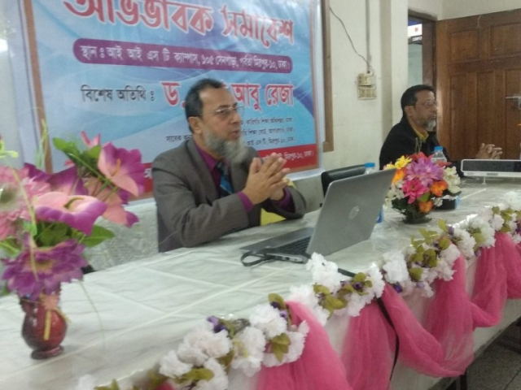

<!-- readme file -->
Dr Sheikh Abu Reza  
How are you
___
_This is italic_  
__This is bold__  
~~This is bold~~  
### 1. Single Line Code
``This is inline``  
### 2. Multiple Line Code
```
<html>
    <head>
    </head>
    <body>
    </body>
</html>
```  
```html
<html>
    <head>
    </head>
    <body>
    </body>
</html>
```

```js
console.log('Helo');
```
```js
console.log('Helo');
```
```css
body{
    color:red;
}
```  
### 3. Order List Code
1. Item1
2. Item2  
        a) Sub Item1  
        b) Sub Item2
3. Item3  
### 4. Unrder List Code  
- Item 1  
- Item 2
    - Item 2.1
    - Item 2.2
- Item 3 
- Item 4 
 ### 5. Task List Code  
 - [x] Task 1
 - [x] Task 2
 - [] Task 3

### 6. Automatic Link  
https://iist-mirpur.edu.bd   

### 7. Disable Link  
`https://iist-mirpur.edu.bd`  

### 8. MD Link  
[IIST](https://iist-mirpur.edu.bd)  

### 9. All MD Short Link   
[IIST](web)  
[FaceBook](fb)  
[YouTube](yt)  

### 10. Image Syntex  
<!--      -->
<!--    -->  

❤️  

### Table  

| Name | Description |  
| ___ | ___ |   
| Salam | Student | 


<!-- All Link Here -->  
[web]:(https://iist-mirpur.edu.bd)
[fb]:(https://fb.com/iistofficial)
[yt]:(https://youtube.com/)
